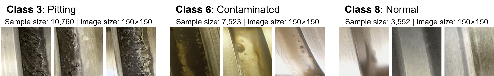

# Tri-classified Dataset for Ball Screw Surface Defects

## Introduction

This is the public repository hosting the three-class dataset for ball screw surface defects, hereinafter referred as ``KIT-BS-recls``, used in the journal paper “**Domain-unique group- and its subgroups-aware fault diagnostics for machine components: An open-set domain adaptation approach**” from amtc Advanced Manufacturing Technology Center at Tongji University. 

It is a reclassified version of the original bi-class dataset published by the wbk Institute of Production Science at the Karlsruhe Institute of Technology, hereinafter referred as ``KIT-BS``.

## Note on Relabellings

The `KIT-BS-recls` dataset was adapted by relabeling a subset of the `normal` class samples in `KIT-BS` to form a new category: `contaminated`. This reflects samples affected by lubricant contamination and improves the clarity of the classification task.

## Dataset Structure

The dataset consists of RGB images (150×150 pixels) representing different surface conditions of ball screws. The images are categorized into the following classes:

- `pitting` (label: 3) — 10,760 samples  
- `contaminated` (label: 6) — 7,523 samples  
- `normal` (label: 8) — 3,552 samples  

The `contaminated` class consists of re-labeled samples from the original `normal` category that exhibited clear signs of lubricant contamination.



## Directory Layout

```
README.md
demo.png
LICENSE.txt
KIT-BS-recls/
├── labels.txt        	# Label file with {sample_path}{space}{integer_label} format
├── samples/
│   ├── contaminated/ 	# Lubricant-contaminated samples
│   ├── normal/       	# Normal surface samples
│   └── pitting/      	# Pitting defect samples
```

## How to Use

1. Clone this repository.
2. Use `KIT-BS-recls/samples` for reclassified images in three class groups. Each image is a 150×150 RGB `.png` file.
3. Use `labels.txt` for supervised learning setups; it maps each image file directory to its class label.

## License

This dataset is distributed under the [Creative Commons Attribution-ShareAlike 4.0 International License (CC BY-SA 4.0)](https://creativecommons.org/licenses/by-sa/4.0/), in accordance with the license of the original dataset.  

## Citation Format

If you use this dataset or find it helpful, please consider citing our paper and/or the original work:

1. This repository & related paper: 

```BibTex
@article{XUE2025131291,
title = {Domain-unique group- and its subgroups-aware fault diagnostics for machine components: An open-set domain adaptation approach},
journal = {Neurocomputing},
pages = {131291},
year = {2025},
issn = {0925-2312},
doi = {https://doi.org/10.1016/j.neucom.2025.131291},
url = {https://www.sciencedirect.com/science/article/pii/S0925231225019630},
author = {Feng Xue and Weimin Zhang and Shulian Xie and Alexander Puchta and Jürgen Fleischer},
keywords = {open-set domain adaptation, fault diagnosis, rolling bearing, ball screw, adversarial learning, transfer learning}
}
```

2. The original two-class dataset & related paper: 

```BibTex
@article{SCHLAGENHAUF2021107643,
title = {Industrial machine tool component surface defect dataset},
journal = {Data in Brief},
volume = {39},
pages = {107643},
year = {2021},
issn = {2352-3409},
doi = {https://doi.org/10.1016/j.dib.2021.107643},
url = {https://www.sciencedirect.com/science/article/pii/S2352340921009185},
author = {Tobias Schlagenhauf and Magnus Landwehr},
keywords = {Condition monitoring, Deep learning, Machine learning, Object detection, Semantic segmentation, Instance segmentation, Classification, Dataset}
}
```

