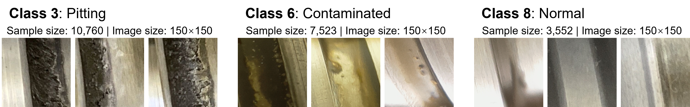

# Tri-classified Dataset for Ball Screw Surface Defects

[**Introduction**](#introduction) | [**How to use**](#how-to-use) | [**Quick Start with Python**](#quick-start-with-python) | [**Dataset Structure**](#dataset-structure) | [**Directory Layout**](#directory-layout) | [**Citation**](#citation) | [**License**](#license)

## Introduction

This is the public repository hosting the three-class dataset for ball screw surface defects, hereinafter referred as ``KIT-BS-recls``, used in the journal paper “**[Domain-unique group- and its subgroups-aware fault diagnostics for machine components: An open-set domain adaptation approach](https://doi.org/10.1016/j.neucom.2025.131291)**” from amtc Advanced Manufacturing Technology Center at Tongji University. 

It is a reclassified version of the original bi-class dataset published by the wbk Institute of Production Science at the Karlsruhe Institute of Technology, hereinafter referred as ``KIT-BS``.

**If you use this dataset in your research, please cite our paper (details in the `Citation` section).**

## How to Use

This section provides two primary ways to access and use the dataset.

### Option 1: Kaggle

For the fastest way to get started, we recommend using our official Kaggle dataset. You can run code directly in your browser.

* Want to get started in your browser? 👉Use our [Official Kaggle Dataset](https://www.kaggle.com/datasets/fenghsueh/tri-class-ball-screw-surface-defects).    
* Want to see a starter notebook? 👉 Fork our [Quick Start Notebook](https://www.kaggle.com/code/fenghsueh/tri-class-ball-screw-surface-defects-quick-start). 

### Option 2: GitHub

For research deployment, you can clone this repository for the complete, original file structure.

1. **Star & Clone**: Please consider ⭐️starring this repository if you find it useful, and 📥clone it to get started:

   ```bash
   git clone https://github.com/fenghsueh/Triclass-BSDefects
   cd Triclass-BSDefects
   ```

2. **Run Verification Script**: The next section demonstrates how to load a sample image and its corresponding label, verifying that the dataset is ready for use.

## Quick Start with Python

1. This script requires the `Pillow` library. If you don't have it, install it via pip: `pip install Pillow`.

2. Run the following script:

   ```python
   import os
   from PIL import Image
   
   # --- Configuration ---
   # Set the base path to the dataset repository
   DATASET_PATH = 'KIT-BS-recls'
   # Edit here to define a sample image to verify
   SAMPLE_IMAGE_RELATIVE_PATH = './samples/contaminated/N(725).png'
   # -------------------
   
   # 1. Load all labels into a dictionary for quick lookup
   print("--> Loading labels from labels.txt...")
   labels_dict = {}
   labels_file_path = os.path.join(DATASET_PATH, 'labels.txt')
   
   try:
       with open(labels_file_path, 'r') as f:
           for line in f:
               # Label format: {sample_path}{space}{integer_label}
               # e.g., "./samples/contaminated/N(725).png 6"
               parts = line.strip().split()
               if len(parts) == 2:
                   path, label = parts
                   labels_dict[path] = int(label)
       print(f"--> Successfully loaded labels for {len(labels_dict)} images.")
   except FileNotFoundError:
       print(f"[Error] 'labels.txt' not found at: {labels_file_path}")
       exit()
   
   # 2. Load the sample image and retrieve its label
   print(f"\n--> Verifying with a sample: '{SAMPLE_IMAGE_RELATIVE_PATH}'")
   full_image_path = os.path.join(DATASET_PATH, SAMPLE_IMAGE_RELATIVE_PATH)
   
   try:
       # Load the image
       with Image.open(full_image_path) as img:
           print(f"  - Image loaded successfully.")
           print(f"    - Details: Format={img.format}, Mode={img.mode}, Size={img.size}")
   
       # Retrieve the label from the dictionary
       if SAMPLE_IMAGE_RELATIVE_PATH in labels_dict:
           label = labels_dict[SAMPLE_IMAGE_RELATIVE_PATH]
           print(f"  - Label retrieved successfully.")
           print(f"    - Label: {label}")
       else:
           print(f"[Error] Label for '{SAMPLE_IMAGE_RELATIVE_PATH}' not found in labels.txt.")
   
       print("\n✅ Verification successful! The dataset is ready to use.")
   
   except FileNotFoundError:
       print(f"❌ Sample image not found at: {full_image_path}")
   except Exception as e:
       print(f"⚠️ An unexpected error occurred: {e}")
   ```

3. Check the output. Under the given example, it should be:

   ```bash
   --> Loading labels from labels.txt...
   --> Successfully loaded labels for 21835 images.
   
   --> Verifying with a sample: './samples/contaminated/N(725).png'
     - Image loaded successfully.
       - Details: Format=PNG, Mode=RGB, Size=(150, 150)
     - Label retrieved successfully.
       - Label: 6
   
   ✅ Verification successful! The dataset is ready to use.
   ```

## Dataset Structure



### Samples and Labels

The dataset consists of 21,835 image samples representing different surface conditions of ball screws. Each image is a 150×150 RGB `.png` file categorized into the following classes, respectively:

- `pitting` (label: 3) — 10,760 samples  
- `contaminated` (label: 6) — 7,523 samples  
- `normal` (label: 8) — 3,552 samples  

### Note on Relabellings

The `KIT-BS-recls` dataset was adapted by relabeling a subset of the `normal` class samples in `KIT-BS` to form a new category: `contaminated`. This reflects samples affected by lubricant contamination and improves the clarity of the classification task.

## Directory Layout

```
README.md
demo.png
quickstart.py
CITATION.cff
LICENSE.txt
KIT-BS-recls/
├── labels.txt        	# Label file; each row is formatted as {sample_path}{space}{integer_label}
├── samples/
│   ├── contaminated/ 	# Lubricant-contaminated samples
│   ├── normal/       	# Normal surface samples
│   └── pitting/      	# Pitting defect samples
```

- Use `KIT-BS-recls/samples` for reclassified images in three class groups.
- Use `labels.txt` for supervised learning setups; it maps each image file directory to its class label.

## Citation

If you use this dataset or find it helpful, please consider citing our paper and/or the original work:

1. This repository & related paper: 

```BibTex
@article{XUE2025131291,
title = {Domain-unique group- and its subgroups-aware fault diagnostics for machine components: An open-set domain adaptation approach},
journal = {Neurocomputing},
volume = {653},
pages = {131291},
year = {2025},
issn = {0925-2312},
doi = {https://doi.org/10.1016/j.neucom.2025.131291},
url = {https://www.sciencedirect.com/science/article/pii/S0925231225019630},
author = {Feng Xue and Weimin Zhang and Shulian Xie and Alexander Puchta and Jürgen Fleischer},
keywords = {open-set domain adaptation, fault diagnosis, rolling bearing, ball screw, adversarial learning, transfer learning}
}
```

2. The original two-class dataset & related paper: 

```BibTex
@article{SCHLAGENHAUF2021107643,
title = {Industrial machine tool component surface defect dataset},
journal = {Data in Brief},
volume = {39},
pages = {107643},
year = {2021},
issn = {2352-3409},
doi = {https://doi.org/10.1016/j.dib.2021.107643},
url = {https://www.sciencedirect.com/science/article/pii/S2352340921009185},
author = {Tobias Schlagenhauf and Magnus Landwehr},
keywords = {Condition monitoring, Deep learning, Machine learning, Object detection, Semantic segmentation, Instance segmentation, Classification, Dataset}
}
```

## License

This dataset is distributed under the [Creative Commons Attribution-ShareAlike 4.0 International License (CC BY-SA 4.0)](https://creativecommons.org/licenses/by-sa/4.0/), in accordance with the license of the original dataset.  
